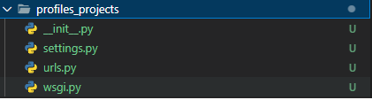
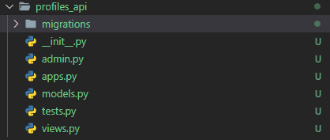

# Profiles REST API

Profiles REST API course code

--------------------

## Initial Commands

```sh
    vagrant init ubuntu/bionic64
```

> Inicializa un archivo de configuración Vagrant en el directorio actual y lo configura para utilizar la imagen de la máquina virtual "ubuntu/bionic64".

```sh
    vagrant up
```

> Crear y configurar una máquina virtual utilizando el archivo **Vagrantfile**.

```sh
    vagrant ssh
```

> Inicializa una sesión SSH en una máquina virtual que ha sido creada y configurada con Vagrant.
>
> Después de ejecutar "vagrant ssh", se establecerá una conexión SSH con la máquina virtual en la que se ejecutará el shell de la terminal de la máquina virtual en la consola del host donde se ejecuta Vagrant. Esto permite al usuario interactuar con la máquina virtual como si estuviera trabajando directamente en ella.

```sh
    django-admin.py startproject profiles_projects .
```

> Llama al script del archivo .py, el segundo parametro es para indicarle que queremos crear un nuevo proyecto, luego indicamos el nombre del proyecto y el ultimo comando, en este caso **'.'** es para indicarle el path donde queremos crear el projecto

### Se nos creara el siguiente proyecto



```sh
    python manage.py startapp profiles_api
```

> Crea la app para nuestro ***profiles_project***

La estructura de django es: root/project_name contendra todos los archivos base del proyecto, como ser **settings**, **urls** y **wsgi**. Luego, pueden existir n apps por projecto y siempre su nomenclatura es <project_name>/appname. En este caso **profiles_projects** es nuestro directorio de proyecto y nuestra app es **profiles_api**, que como se puede apreciar, primero contiene el nombre del projecto y luego el de la app

### Se nos creara el siguiente directorio que contendra la app



```sh
    python manage.py runserver 0.0.0.0:8000
```

> Ejecutamos el script manage.py y le indicamos que queremos correr el servidor con el comando **runserver**, en este caso, en el puerto 8000 (debe matchear con el establecido en el archivo **Vagrantfile** [```config.vm.network "forwarded_port", guest: 8000, host: 8000```] ) y lo hace disponible a todos los adaptadores de red disponibles mediante **0.0.0.0**

--------------------

## Settings

Archivo de configuracion de nuestro proyecto.
Dentro, podemos encontrar un array denominado ***INSTALLED_APPS***, que contendra todas las aplicaciones que utilizara nuestro projecto.

```py
    INSTALLED_APPS = [
    'django.contrib.admin',
    'django.contrib.auth',
    'django.contrib.contenttypes',
    'django.contrib.sessions',
    'django.contrib.messages',
    'django.contrib.staticfiles',
    'rest_framework',
    'rest_framework.authtoken',
    'profiles_api',
]
```

Comenzaremos activando algunas apps que necesitaremos para este proyecto:

**rest_framework**
: agregamos la dependencia rest_framework de django, la cual necesitaremos en nuestro proyecto.

**rest_framework.authtoken**
: no permitira utilizar la funcionalidad de autenticacion de token que viene con el framework.

**profiles_api**
: por ultimo agregamos nuestra aplicacion.

--------------------

### Como setear un modelo custom

Dentro de nuestro archivo settings.py, agregamos la siguiente linea

```py
    AUTH_USER_MODEL = 'profiles_api.UserProfile
```

Le especificamos a django que el modelo contenido dentro de profiles_api, sera el modelo que utilizara para la autenticacion y registros de toda la app.

De esta manera se configura un modelo en django

--------------------

## Models

En este archivo se crean los modelos que utilizara nuestra aplicacion.

```py
from django.contrib.auth.models import (AbstractBaseUser, BaseUserManager,PermissionsMixin)
from django.db import models


class UserProfileManager(BaseUserManager):
    """
        Manager for user profiles
    """
    def create_user(self, email, name, password=None):
        if not email:
            raise ValueError('User must have an email address')
        email = self.normalize_email(email)
        user = self.model(email=email, name=name)

        # This method is inherited from AbstractBaseUser class and it hash the password
        user.set_password(password)

        user.save(using=self._db)

        return user

    def create_superuser(self, email, name, password):
        user = self.create_user(email, name, password)
        user.is_superuser = True
        user.is_staff = True
        user.save(using=self._db)
        return user


class UserProfile(AbstractBaseUser, PermissionsMixin):
    """
        Database model for users in the system
    """
    email = models.EmailField(max_length=255, unique=True)
    name = models.CharField(max_length=255)
    is_active = models.BooleanField(default=True)
    is_staff = models.BooleanField(default=False)

    objects = UserProfileManager()

    # Cuando se autentiquen, mediante este metodo indicamos que en lugar de utilizar el nombre de la
    # persona, utilizara el campo email como usuario
    USERNAME_FIELD = 'email'

    REQUIRED_FIELDS = ['name']

    def get_full_name(self):
        """
            Retrieve full name of user
        """
        return self.name

    def get_short_name(self):
        """
            Retrieves short name of the user
        """
        return self.name

    def __str__(self):
        """
            Return string representation of our user
        """
        return self.email

```

--------------------

## Migrations

La manera en la que django maneja la base de datos es creando un archivo *migration* que contenga todos los pasos requeridos para que nuestra base de datos matchee con nuestros modelos. Por lo cual, cada vez que creamos o modificamos un modelo, debemos crear o actualizar el archivo migration

Serian como nuestro ORM.

El siguiente comando creara por nosotros los migrations para los modelos de nuestra app
:

```sh
    python manage.py makemigrations profiles_api
```

Para correr todos los migrations de nuestro proyecto utilizamos el siguiente comando:

```sh
    python manage.py migrate
```

--------------------

## Crear Superuser utilizando Django CLI

Con el siguiente comando crearemos un superusuario para django que pueda ver, administrar, modificar, etc., la base de datos

```sh
    python manage.py createsuperuser
```

--------------------

## Como habilitar Django Admin

Dentro de admin.py, debemos agregar la siguiente linea dependiendo la cantidad de modelos que tenga nuestra app:

```py
    from django.contrib import admin

    from profiles_api import models

    admin.site.register(models.UserProfile)
```

--------------------

# Info

## APIView

Aqui se describe la logica de nuestro endpoint

Casos de uso:

- Cuando necesitas full control de la logica de tu aplicacion
- Cuando procesas archivos y renderizando una respuestra sincrona
- Cuando necesitamos llamar a otras APIs/servicios
- Cuando necesitamos acceder a archivos del projecto

### APIView route

Creamos un nuevo archivo en nuestra app (**NO EN EL PROYECTO**) denominado, en este caso, urls.py

En el archivo urls.py del proyecto, agregamos el import include para poder utilizar el archivo urls.py de nuestra aplicacion y luego procedemos a agregar otro elemento al array **url_patterns**. Indicando el 'home' de la ruta y como segundo parametro, utilizamos el metodo include al cual le enviamos por parametro el archivo que utilizaremos para esa ruta.

Quedara algo como lo siguiente

```py
from django.contrib import admin
from django.urls import include, path

urlpatterns = [
    path("admin/", admin.site.urls),
    path("api/", include("profiles_api.urls")),
]
```

Luego en el archivo urls.py de nuestra app, agregaremos el siguiente codigo y quedara similar al archivo de nuestro proyecto

```py
from django.urls import path

from profiles_api import views

urltpatterns = [path("/hello-view", views.HelloApiView.as_view())]

```

De esta manera, cada vez que accedamos a api/endpoint, el archivo urls.py de nuestro proyecto, vera que para ese path, tiene un include asignado, en este caso el archivo urls.py de nuestra app.
Por lo cual, cada vez que accedamos a api/endpoint lo que hara el archivo es enviarlo directamente al archivo urls.py de la app y ejecutar la funcion asignada a ese endpoint

## Serializer

Es una feature del framework djangorest que nos permite convertir facilmente de inputs de datos a objetos de python y viceversa.
Es una buena practica tener 1 solo archivo serializer para toda la app

## ViewSet

Como las APIViews, nos permiten escribir logica para nuestros endpoints. Sin embargo, en lugar de definir funciones cuya definicion coincida con el metodo HTTP utiliza operaciones del modelo para las funciones

- Se encarga de ejecutar logica como el APIView.
- Es perfecto para las operaciones estandar con la BD
- Es la manera mas rapida de crear una interfaz de la BD

**Casos de uso**
:

- Una simple interfaz CRUD con la BD
- Una API rapida y simple
- Si no necesita customizacion en la logica, utilizamos los dispuestos por Django RestFramework
- Si la aplicacion trabaja con estructuras de datos estandar
